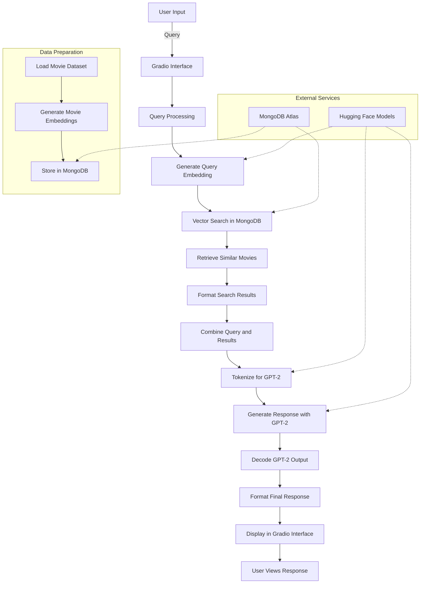

# AI-Powered Movie Recommendation Bot with GPT-2 and MongoDB

In this project, I have developed a Movie Recommendation Bot that uses advanced Natural Language Processing (NLP) and NoSQL database technologies.

My bot utilizes:

- GPT2 for generating conversational responses.
- Atlas MongoDB Cloud to store and manage text embeddings.
- PyMongo to connect to MongoDB.
- Sentence Transformers for loading a pre-trained embedding model.
- Hugging Face Transformers for various NLP tasks.
- Gradio for creating an interactive web interface.
- Hugging Face Space for deploying the bot.

This bot allows users to ask for movie recommendations and receive detailed responses, using natural language processing and vector search techniques.

The project showcases my journey and learning in the AI/ML domain, demonstrating my ability to apply these technologies to real-world scenarios.

[Click here to access the bot!](https://huggingface.co/spaces/kanad13/Movie-Recommendation-Bot).

You can look at the detailed code and its explanation below.

## Project Workflow

In this section I have explained in detail how the bot works. You can directly look at the code [here](app.py).

See below the mermaid diagram that represents the user flow.



### Step 1 - Import Libraries

I start by importing all the necessary libraries.
These include - Gradio for the web interface, - Pandas for data manipulation, - Hugging Face libraries for loading datasets and pre-trained models, and - PyMongo for interacting with MongoDB

```python
import gradio as gr
import pandas as pd
from datasets import load_dataset
from sentence_transformers import SentenceTransformer
from transformers import AutoTokenizer, AutoModelForCausalLM
import pymongo
import os
```

### Step 2 - Load and Prepare the Dataset

The dataset is loaded from Hugging Face, specifically the `MongoDB/embedded_movies` dataset. [This dataset](https://huggingface.co/datasets/MongoDB/embedded_movies) contains a collection of movie data, including movie titles, years of release, genres, and ratings. It also includes arrays of items such as genres, actors, and directors, providing comprehensive information about each movie.

In my code, I focus on the fullplot field to generate embeddings, as this field contains the detailed plot descriptions necessary for performing similarity searches. The other fields, such as genres, are used to provide additional context in the recommendations.

In my code, I convert this dataset to a Pandas DataFrame.

```python
dataset = load_dataset("MongoDB/embedded_movies", split='train[:80%]')
dataset_df = pd.DataFrame(dataset)
```

Next, I ensure that all entries have complete plot descriptions by removing rows with missing `fullplot` values. I also drop the `plot_embedding` column, as I will generate new embeddings.

```python
dataset_df = dataset_df.dropna(subset=["fullplot"])
dataset_df = dataset_df.drop(columns=["plot_embedding"])
```

### Step 3 - Generate Embeddings

In this step, I load a pre-trained embedding model from [Sentence Transformers](https://huggingface.co/thenlper/gte-large). Sentence Transformers are models designed to generate vector representations (embeddings) for sentences, phrases, or texts. These embeddings capture the semantic meaning of the text, making it possible to perform tasks like clustering, classification, search, and retrieval in a semantically aware manner.

Specifically, I have used the `thenlper/gte-large` model, which is part of the General Text Embeddings (GTE) family. This model is fine-tuned to provide high-quality sentence embeddings that are particularly useful for general-purpose text embedding tasks.

```python
embedding_model = SentenceTransformer("thenlper/gte-large")
```

I have defined a function to generate embeddings for a given text. If the text is empty, an empty list is returned to avoid errors.

```python
def get_embedding(text: str) -> list:
    if not text.strip():
        print("Attempted to get embedding for empty text.")
        return []
    embedding = embedding_model.encode(text)
    return embedding.tolist()
```

I then apply this function to the `fullplot` column to generate embeddings for each movie plot.

```python
dataset_df["embedding"] = dataset_df["fullplot"].apply(get_embedding)
```

### Step 4 - Setup MongoDB

This step is not part of the python code. I had to execute this step outside on another website - [MongoDB](https://www.mongodb.com)
MongoDB is a NoSQL database. It uses a document-oriented data model and stores data in JSON-like documents. These docs may vary in structure and allow for nested fields.
The Pandas DataFrame I created in the previous step, is converted to a list of dictionaries and inserted into the MongoDB collection in the next step.
For each movie plot from the Movie dataset, a text embedding is generated using pre-trained `thenlper/gte-large` model. These embeddings are stored in MongoDB. This allows my bot to make similarity searches.

I have created a Shared (free) MongoDB Atlas account on Azure. You can do it too [here](https://www.mongodb.com/pricing).
Once the free account is created, then create a cluster as documented [here](https://www.mongodb.com/docs/guides/#atlas).

Ensure that you whitelist the IP for the Python host or 0.0.0.0/0 for any IP.

Then create a MongoDB database using the steps [here](https://www.mongodb.com/resources/products/fundamentals/create-database). The database should be named `movies`. And the collection should be named `movie_collection_2` (since MongoDB already creates a movie_collection as part of the default collection creation process).

Then secure the connection string as documented [here](https://www.mongodb.com/docs/guides/atlas/connection-string/). Keep it safe on the side, since we will use it later.

Now create an index in MongoDB Atlas

- Go to your Atlas cluster's dashboard.
- Navigate to the "Search" tab.
- Click "Create Search Index".
- Choose "JSON Editor" for index creation.
- Select your database ("movies") and collection ("movie_collection_2").
- Paste the following JSON configuration into the editor:

```json
{
	"mappings": {
		"dynamic": true,
		"fields": {
			"embedding": {
				"dimensions": 1024,
				"similarity": "cosine",
				"type": "knnVector"
			}
		}
	}
}
```

- Name your index "vector_index".
- Click "Create" to finalize the index creation.

This Vector Search Index is useful for us for traversing the `movie_collection_2` and retrieving documents with embeddings that match the query embedding based on vector similarity.

### Step 5 - Setup Hugging Face Space

In this step, I have created a Hugging Face account and created a public space as documented [here](https://huggingface.co/docs/hub/en/spaces-overview).
Once the space is created, then you can create 3 new files and copy the code from this repository

- [app.py](./app.py)
- [requirements.txt](./requirements.txt)
- [readme.md](./readme.md)

Also, create a new secret in your repository as shown [here](https://huggingface.co/docs/hub/en/spaces-overview#managing-secrets). The value of the secret should be the connection string copied earlier.

### Step 6 - Connect to MongoDB

In the previous step I have setup the MongoDB and also created a vector search.
In this step, I will come back to my python code and connect to the MongoDB.

```python
def get_mongo_client(mongo_uri):
    try:
        client = pymongo.MongoClient(mongo_uri)
        print("Connection to MongoDB successful")
        return client
    except pymongo.errors.ConnectionFailure as e:
        print(f"Connection failed: {e}")
        return None

mongo_uri = os.getenv("MONGO_URI")
if not mongo_uri:
    print("MONGO_URI not set in environment variables")

mongo_client = get_mongo_client(mongo_uri)
db = mongo_client["movies"]
collection = db["movie_collection_2"]
```

I will clear the collection to avoid duplication, and insert new data.

```python
collection.delete_many({})
documents = dataset_df.to_dict("records")
collection.insert_many(documents)
print("Data ingestion into MongoDB completed")
```

### Step 7 - Perform Vector Search

In this step, I have created a function to perform a vector search on the user query.

The vector search pipeline uses [MongoDB Atlas Search](https://www.mongodb.com/docs/atlas/atlas-search). It supports vector searches.

But what is meant by Vector search?
This technique allows us to find items in a dataset that are similar to a given query based on their vector representations (embeddings).

In this project, I use vector search to find movies with plots that are semantically similar to the query asked to the bot. Here is how it works:

- **Generate Query Embedding** - Convert the user's query into an embedding using the same model that was used to create the movie plot embeddings.
- **Search for Similar Embeddings**: Use MongoDB Atlas Search to compare the query embedding with the embeddings stored in the database. This is done using a cosine similarity measure, which identifies embeddings that are close to the query in the high-dimensional space.
- **Retrieve Results**: The closest matches are retrieved and presented to the user as movie recommendations.

This method ensures that the recommendations are based on the actual semantic content of the movie plots, leading to more relevant and accurate results.

This pipeline uses the generated query embedding to search for similar embeddings in the MongoDB collection.

```python
def vector_search(user_query, collection):
    query_embedding = get_embedding(user_query)
    if query_embedding is None:
        return "Invalid query or embedding generation failed."

    pipeline = [
        {
            "$vectorSearch": {
                "index": "vector_index",
                "queryVector": query_embedding,
                "path": "embedding",
                "numCandidates": 150,
                "limit": 4,
            }
        },
        {
            "$project": {
                "_id": 0,
                "fullplot": 1,
                "title": 1,
                "genres": 1,
                "score": {"$meta": "vectorSearchScore"},
            }
        },
    ]
    results = collection.aggregate(pipeline)
    return list(results)
```

### Step 8 - Format Search Results

To make the search results user-friendly, I have formatted them into a readable string. Only the first 200 characters of the plot are included for brevity.

```python
def get_search_result(query):
    get_knowledge = vector_search(query, collection)
    search_result = ""
    for result in get_knowledge:
        search_result += f"Title: {result.get('title', 'N/A')}\nGenres: {', '.join(result.get('genres', ['N/A']))}\nPlot: {result.get('fullplot', 'N/A')[:200]}...\n\n"
    return search_result
```

### Step 9 - Generating Responses

I use a pre-trained [GPT-2 model](https://huggingface.co/gpt2) from the Hugging Face "transformers" library to generate human-like responses based on the search results from the vector search.

This model is pre-trained on a large corpus of English text and is fine-tuned for generating coherent and contextually relevant text.

While GPT-2 formulates coherent and contextually relevant responses to user queries, it does not perform the recommendation logic itself. The recommendation logic is handled by the vector search in MongoDB, which retrieves movies with plots that are semantically similar to the user's query. GPT-2 takes the results from this search and generates a natural language response, providing a seamless conversational experience.

Here's the process:

- **Tokenization** - Convert the search results and the user's query into a format that GPT-2 can process using a tokenizer.
- **Generate Response** - Use GPT-2 to generate a text response based on the combined information of the query and the search results.
- **Decode and Present** - Decode the generated response and present it to the user.

The tokenizer converts text to a format that the model can understand, and the model generates responses.

```python
tokenizer = AutoTokenizer.from_pretrained("gpt2-medium")
model = AutoModelForCausalLM.from_pretrained("gpt2-medium")

def generate_response(query):
    source_information = get_search_result(query)
    combined_information = (
        f"Answer the question '{query}' based on these movie details:\n\n{source_information}"
    )

    max_length = tokenizer.model_max_length
    input_ids = tokenizer(combined_information, return_tensors="pt", max_length=max_length, truncation=True)

    try:
        response = model.generate(
            **input_ids,
            max_new_tokens=150,
            num_return_sequences=1,
            no_repeat_ngram_size=2,
            top_k=50,
            top_p=0.95,
            temperature=0.7,
            do_sample=True
        )
        return tokenizer.decode(response[0], skip_special_tokens=True)
    except Exception as e:
        return f"An error occurred: {str(e)}"
```

There is an importnat point to note about the tokenization and truncation topics.

- Tokenization converts the combined search results and the user's query into a format that the GPT-2 model can process.
- Truncation ensures that the input does not exceed the model's maximum token capacity.

Thus, truncation causes loss of some information if the text is too long. This can affect the quality of the generated response, as the model considers only the truncated input.

### Step 10 - Handle User Queries

This function ties everything together, handling user queries and generating responses.

```python
def query_movie_db(user_query):
    return generate_response(user_query)
```

### Step 11 - Create the Gradio Interface

In this step I have created a simple web interface for users to interact with the Movie Recommendation Bot.
Users can enter queries and receive responses through a web interface.

```python
iface = gr.Interface(
    fn=query_movie_db,
    inputs=gr.Textbox(lines=2, placeholder="Enter your movie query here..."),
    outputs="text",
    title="Movie Database Query",
    description="Ask about movies and get detailed responses.",
    examples=[["Suggest me a scary movie?"], ["What action movie can I watch?"]]
)

if __name__ == "__main__":
    iface.launch()
```

### Model Choices

In this project, I have made specific choices for the embedding and language models:

- Embedding Model - "thenlper/gte-large"
  - I chose the "thenlper/gte-large" model for generating text embeddings.
  - This model is part of the General Text Embeddings (GTE) family and is known for producing high-quality sentence embeddings.
  - It is particularly well-suited for general-purpose text embedding tasks, making it ideal for encoding movie plots and user queries in our recommendation system.
- Language Model - "gpt2-medium"
  - For response generation, I opted for the "gpt2-medium" model.
  - This choice balances performance and resource requirements.
  - GPT-2 Medium has 355 million parameters, offering a good trade-off between generation quality and computational efficiency.
  - It is capable of producing coherent and contextually relevant responses while being more manageable in terms of memory and processing requirements compared to larger models like GPT-2 Large or GPT-3.

These model choices aim to provide a balance between performance and efficiency, allowing the my Hugging Face Space with limited capacity to generate high-quality recommendations.

### Resource Constraints

My Movie Recommendation Bot is designed to provide quick responses based on user queries. You might notice that the bot's responses are sometimes truncated, often containing only part of a sentence. This is not a coding issue but a result of operating within the token limitations of the free tier of Hugging Face resources.

There are several ways to enhance the bot's response quality by using better models and more resources. However, these improvements come with increased costs, and since this is my hobby project, I do not want to spend money on it.

I want the bot to operate within the limitations of free resources. This balances functionality with available computational capacity.

This is a list of current limitations of the bot

- **Truncated Responses** - Due to model constraints and implementation choices, responses are often cut short, potentially omitting valuable information.
- **Limited Context Understanding** - The current model may struggle with complex queries or nuanced movie descriptions.
- **Resource Constraints** - Running on Hugging Face Spaces with limited computational resources can affect response time and quality.

These are some potential ways to improve responses

- **Use More Advanced Language Models**: Implementing models like OpenAI GPT or Google Gemma could significantly improve response quality. However, this would substantially increase operational costs.
- **Increase Token Limits**: Expanding from the current 150 tokens to at least 1000 tokens for response generation would allow for longer, more comprehensive responses and include more movie details and recommendations. Again, this would increase costs significantly.
- **Implement Multi-turn Conversations**: This feature would allow users to ask follow-up questions and retain context throughout the conversation, enhancing user experience. However, it would require additional computational resources.
- **Implement Hybrid Search**: Combining vector and keyword search could provide more accurate movie recommendations. This improvement would lead to increased index size and higher computational requirements for search operations.

While these improvements could enhance the bot's functionality, they are currently beyond my scope due to resource constraints.

### Conclusion

By combining the power of Gradio, Hugging Face, and MongoDB, I have created a cool movie recommendation system.
This system leverages advanced natural language processing and vector search techniques to provide detailed and relevant movie recommendations. The use of pre-trained models and efficient data handling ensures that the system is both powerful and scalable, ready to handle a variety of user queries with ease.

## Acknowledgements

- **Hugging Face** - For providing the pre-trained models, the datasets, the Space, so many things.
- **Gradio** - For letting me use their library to create the web interface.
- **MongoDB** - For letting me use their free tier to set up a vector database.
